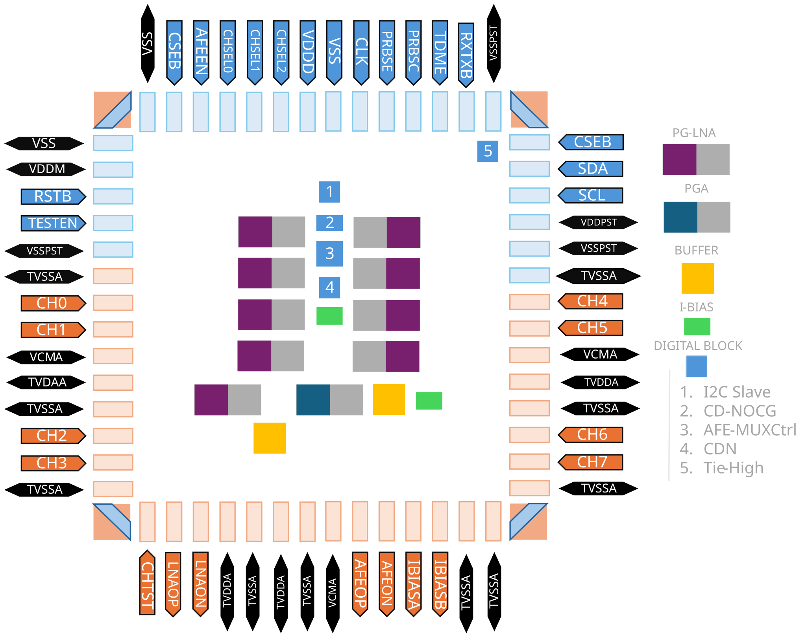
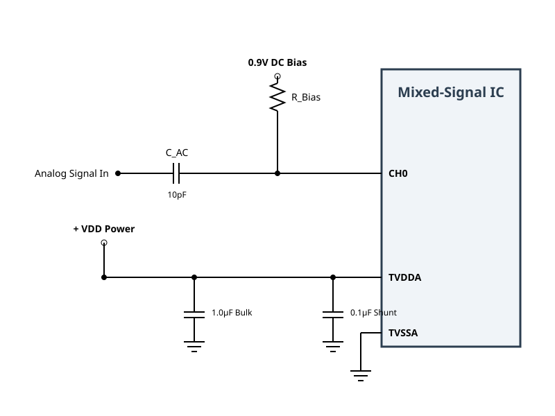

# FIALNA Tapeout Documentation

- *Tapeout Date*: 20 Nov. 2025

- *Author*: Diogo André Silvares Dias, NOVA University of Lisbon, TU Delft

## Chip Architecture Overview

The active silicon here described is designed to perform

1. The reliable readout of ultrasound signals from 8 sub-array channels + 1 testing channel, using a programable-gain low-noise amplifier

2. the compressive multiplexing of 8 inputs into a signal output (8:1 channel reduction) using a novel charge-sharing compressive multiplexing architecture clocked at 50 MHz global clock.

The architectural overview of the chip can be observed in the following view:

---

# ASIC Pinout

---

## Analog Pins

| Pin | Direction | Voltage | Description |
|---|---|---|---|
| `CH0` | Input | 1.8 V | Analog channel 0 input |
| `CH1` | Input | 1.8 V | Analog channel 1 input |
| `CH2` | Input | 1.8 V | Analog channel 2 input |
| `CH3` | Input | 1.8 V | Analog channel 3 input |
| `CH4` | Input | 1.8 V | Analog channel 4 input |
| `CH5` | Input | 1.8 V | Analog channel 5 input |
| `CH6` | Input | 1.8 V | Analog channel 6 input |
| `CH7` | Input | 1.8 V | Analog channel 7 input |
| `VCMA` | Input | 1.8 V | Common-mode voltage reference |
| `LNAON` | Output | 1.8 V | LNA differential output — negative |
| `LNAOP` | Output | 1.8 V | LNA differential output — positive |
| `AFEON` | Output | 1.8 V | AFE differential output — negative |
| `AFEOP` | Output | 1.8 V | AFE differential output — positive |
| `IBIASA` | Input | 1.8 V | Bias current reference A |
| `IBIASB` | Input | 1.8 V | Bias current reference B |
| `CHTST` | Output | 1.8 V | Channel test output |

---

## Digital Control Pins

| Pin | Direction | Active | Voltage | FPGA Signal | Description |
|---|---|---|---|---|---|
| `RSTB` | Input | Low | 1.8 V | `chip_rstb` | Chip reset |
| `CSEB` | Input | Low | 1.8 V | `cseb` | Chip select enable |
| `RXTXB` | Input | Low | 1.8 V | `rxtxb` | RX / TX mode select |
| `TESTEN` | Input | High | 1.8 V | `testen` | Test mode enable |
| `AFEEN` | Input | High | 1.8 V | `afeen` | AFE enable |
| `CLK` | Input | — | 1.8 V | `clkafe` | AFE clock |
| `PRBSC` | Input | — | 1.8 V | `prbs_cross_out` | PRBS cross input |
| `PRBSE` | Input | — | 1.8 V | `prbs_enable_out` | PRBS enable input |
| `CHSEL0` | Input | — | 1.8 V | — | Channel select bit 0 |
| `CHSEL1` | Input | — | 1.8 V | — | Channel select bit 1 |
| `CHSEL2` | Input | — | 1.8 V | — | Channel select bit 2 |
| `TDME` | Input | High | 1.8 V | — | TDM enable |
| `SCL` | Input | — | 1.8 V | `i2c_scl` | I2C clock (slave) |
| `SDA` | Bidir | — | 1.8 V | `i2c_sda` | I2C data (slave) |

---

## Power and Ground Pins

| Pin | Type | Voltage | Description |
|---|---|---|---|
| `VDDD` | Power | 0.9 V | Digital supply |
| `VDDPST` | Power | 1.8 V | I/O post supply |
| `VDDM` | Power | 0.9 V | Mixed-signal supply |
| `TVDDA` | Power | 1.8 V | Test analog supply A |
| `TVDAA` | Power | 1.8 V | Test analog supply A (aux) |
| `VSS` | Ground | 0 V | Digital ground |
| `VSSPST` | Ground | 0 V | I/O post ground |
| `TVSSA` | Ground | 0 V | Test analog ground A |

---

## Internal Block Notes

| # | Note |
|---|---|
| 1 | PGA is controlled as an **I2C slave** |
| 2 | **CD-NOCG** — clock distribution, no clock gating |
| 3 | **AFE-MUX Ctrl** — AFE input mux controlled by `CHSEL[2:0]` |
| 4 | **CDN** — internal |
| 5 | Tie-High — internal tie cell |

---

## Recommended PCB Integration

> **AC Coupling Considerations**

### High-Pass Filter Characteristics

The AC coupling capacitor ($C_{AC}$) and the bias resistor ($R_{Bias}$) form a first-order high-pass filter. The cutoff frequency ($f_c$) is determined by the following formula:

$$f_c = \frac{1}{2 \pi R_{Bias} C_{AC}}$$

With a **10 pF** capacitor, your choice of $R_{Bias}$ will heavily dictate what signals can pass through to the analog channels without attenuation:

* **If $R_{Bias} = 10\text{ k}\Omega$:** $f_c \approx 1.59\text{ MHz}$
* **If $R_{Bias} = 100\text{ k}\Omega$:** $f_c \approx 159\text{ kHz}$
* **If $R_{Bias} = 1\text{ M}\Omega$:** $f_c \approx 15.9\text{ kHz}$

### Component Selection Notes for 10 pF

* **Dielectric Choice:** At 10 pF, you should strictly use **C0G (NP0)** ceramic capacitors. They offer the tightest tolerances, no piezoelectric noise, and excellent stability over temperature and voltage, which is critical for small capacitance values.

* **Parasitics:** When working with 10 pF capacitors, PCB trace capacitance can easily add 1–3 pF of parasitic capacitance. Keep the traces between the capacitor, the bias resistor, and the IC pin as short as possible to prevent unintended shifts in your cutoff frequency.
